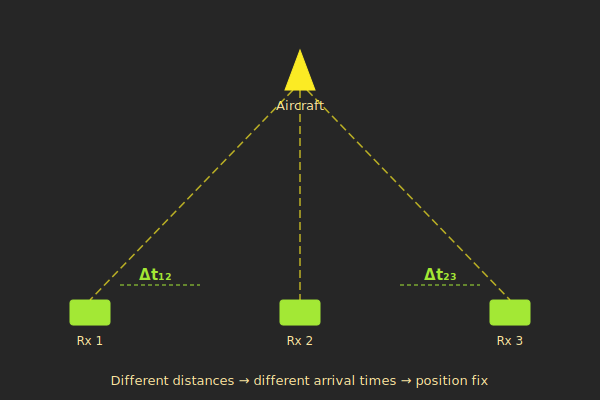

# What is ADS-B?

Every second, thousands of aircraft broadcast their identity, position, altitude, and velocity as radio signals on 1090 MHz. This is ADS-B --- Automatic Dependent Surveillance-Broadcast --- and anyone with the right receiver can listen in.

This page explains the fundamentals: what aircraft are broadcasting, how the signals are structured, and why an FPGA gives us capabilities that software alone cannot match.

---

## The big picture

The complete flow from aircraft to flight tracker is surprisingly short:

```mermaid
flowchart LR
    A["&#9992;&#65039; Aircraft Transponder"] -->|"1090 MHz broadcast"| B["&#128225; Receiver"]
    B -->|"Beast TCP"| C["&#128506;&#65039; Flight Tracker"]
    B -->|"MLAT timestamps"| D["&#128205; Multilateration Server"]
```



An aircraft transponder emits a burst of radio energy on 1090 MHz. A receiver picks it up, decodes the message, and forwards it in a standard format called "Beast" over a TCP connection. Flight tracking services aggregate feeds from thousands of receivers worldwide to build the real-time maps you see on sites like Flightradar24.

The second output path --- MLAT timestamps --- is where things get interesting, and where plane_watcher's FPGA approach really pays off. More on that below.

---

## Why planes broadcast

ADS-B is a safety system designed for air traffic control. Aircraft carry transponders that continuously **squitter** --- they broadcast without being asked. No radar interrogation needed. The aircraft's GPS computes its position, and the transponder announces it to anyone listening.

This was designed for ATC, but the signals are **unencrypted and publicly receivable**. There is no authentication, no access control, and no subscription fee. Anyone with a 1090 MHz antenna and appropriate receiver can decode these messages. This is exactly how community flight tracking networks like [Flightradar24](https://www.flightradar24.com/), [ADS-B Exchange](https://www.adsbexchange.com/), and [plane.watch](https://plane.watch/) work --- they aggregate data from volunteer-run receivers distributed around the world.

---

## The 1090 MHz signal

The protocol is called **Mode-S** (Mode Select). Each transmission is a short burst called a "squitter" --- a self-contained message broadcast at 1090 MHz.

There are two message sizes:

- **Short messages (56 bits):** Surveillance replies containing altitude, identity, or ICAO address. These are typically responses to radar interrogation or all-call replies.
- **Extended messages (112 bits):** ADS-B squitters containing position, velocity, and aircraft identification. These are the self-broadcast messages that make flight tracking possible.

The message type is identified by its **Downlink Format (DF)** field --- the first 5 bits of every message:

| DF | Name | Length | Contains |
|----|------|--------|----------|
| 0 | Short air-air surveillance | 56 bits | Altitude |
| 4 | Surveillance altitude reply | 56 bits | Altitude |
| 5 | Surveillance identity reply | 56 bits | Squawk code |
| 11 | All-call reply | 56 bits | ICAO address |
| 17 | Extended squitter (ADS-B) | 112 bits | Position, velocity, ident |
| 18 | Extended squitter (TIS-B/ADS-R) | 112 bits | Non-transponder ADS-B |

DF17 is the one most people care about --- it carries the latitude, longitude, altitude, velocity, and callsign that make flight tracking possible. But the short formats are valuable too: DF11 reveals an aircraft's unique ICAO address, and DF4/DF5 provide altitude and squawk codes for aircraft that respond to radar but do not broadcast ADS-B.

---

## Message structure

Every Mode-S message follows the same basic layout:

```
 DF field (5 bits)  -->  Payload  -->  PI/CRC (24 bits)
```

- **DF field (5 bits):** Identifies the message type (see table above).
- **Payload:** The actual content --- altitude, position, identity, etc.
- **PI/CRC (24 bits):** A checksum that lets the receiver verify the message was not corrupted in transit. For some formats, the ICAO aircraft address is XORed into this field.

The two message lengths work out neatly:

- **Short:** 5 + 27 + 24 = **56 bits** (7 bytes)
- **Extended:** 5 + 83 + 24 = **112 bits** (14 bytes)

The CRC is critical. At 1090 MHz, signals are weak and interference is common. A 24-bit CRC catches almost all corruption --- and advanced receivers can even use it to *correct* single-bit errors by brute-forcing candidate bit flips and re-checking the CRC. plane_watcher does exactly this, trying up to 32 combinations of the 5 least-confident bits in each message.

---

## What is MLAT?

**Multilateration** (MLAT) solves a specific problem: older aircraft with Mode-S transponders that *do not* broadcast ADS-B position.

A single receiver can decode the *content* of a Mode-S message --- altitude, squawk code, ICAO address --- but without ADS-B, there is no position in the message. MLAT recovers the position using geometry.



Here is the idea: if **three or more receivers** report the **exact time** they received the same message, the time differences between receivers reveal the aircraft's position. Each pair of receivers and their time difference defines a hyperboloid (a curved surface in 3D space). The intersection of three or more hyperboloids gives the aircraft's location.

This is GPS in reverse. GPS satellites broadcast at known times and your phone computes its own position from the arrival time differences. MLAT does the same thing, but the aircraft is the "satellite" and the ground receivers are the ones solving for position.

> **The precision requirement is severe.** Radio signals travel at the speed of light --- roughly 300 metres per microsecond. Every 100 nanoseconds of timing error translates to approximately 30 metres of position uncertainty. To produce useful MLAT data, timestamps need to be accurate to tens of nanoseconds, not microseconds.

This is the single biggest reason plane_watcher uses an FPGA.

---

## Why an FPGA?

The most common ADS-B receiver setup is a $25 RTL-SDR dongle plugged into a computer running [dump1090](https://github.com/antirez/dump1090) or one of its forks. This works well for basic flight tracking, but it has fundamental limitations for MLAT:

| Approach | Timing precision | Parallel decode | Cost |
|----------|-----------------|-----------------|------|
| RTL-SDR + software (dump1090) | ~1 us (OS jitter) | 1 at a time | ~$25 |
| FPGA hardware decode | ~62.5 ns (clock cycle) | 8 simultaneous | ~$150 |

The difference comes down to architecture:

**Software receivers** process radio samples in batches. The USB transfer from the RTL-SDR dongle arrives in chunks. The operating system schedules the decoder process alongside everything else running on the computer. Context switches, interrupt handling, and USB latency all add jitter to timestamps. The result is timing precision in the low microseconds --- fine for displaying aircraft on a map, but too coarse for high-quality MLAT.

**FPGA receivers** process every single sample in real-time, on the clock cycle it arrives. There is no operating system, no interrupts, no scheduling jitter. The timestamp counter runs on a dedicated 100 MHz clock, giving 10 ns resolution. When a preamble is detected, the timestamp is latched in the same clock cycle --- no software delay, no buffering. The result is timing precision in the tens of nanoseconds.

The FPGA also runs **8 parallel decoders** simultaneously. In busy airspace near airports, multiple aircraft can transmit within the same 120-microsecond window. A software decoder processes one message at a time and must finish before it can start the next. The FPGA assigns each detection to an independent decoder, handling overlapping transmissions without dropping messages.

---

## Where plane_watcher fits

plane_watcher implements the FPGA approach. The entire ADS-B decode pipeline --- from raw radio samples through preamble detection, bit decoding, error correction, and CRC validation --- runs in hardware on a Zynq-7020 FPGA. Every decoded message carries a nanosecond-resolution timestamp suitable for MLAT.

The FPGA passes decoded messages to a Linux system running on the same chip, which formats them into the standard Beast binary protocol and sends them over the network to flight tracking services and MLAT servers.

The next page explains how the hardware and software sides work together.

---

**Next:** [System Overview -->](02-System-Overview.md)
