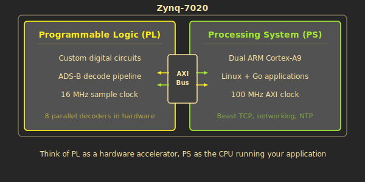
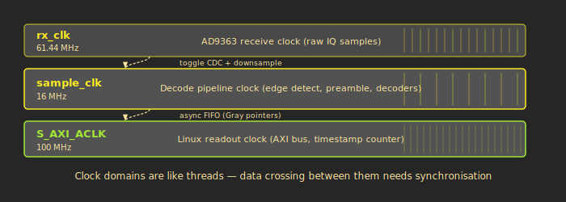

# System Overview

plane_watcher runs on a Zynq-7020 --- a chip that combines an FPGA and a Linux computer in a single package. The FPGA handles real-time signal processing, while Linux handles formatting, networking, and configuration.

This page maps out the full system: what the hardware looks like, how the two halves of the chip communicate, and how radio signals flow from antenna to flight tracker.

---

## The hardware

The physical setup is compact:

- **Zynq-7020 SoC** on a Fishball board (PlutoSDR-compatible form factor, roughly credit-card sized)
- **AD9363 SDR front-end** --- a software-defined radio transceiver that tunes to 1090 MHz and digitises the received signal
- **1090 MHz antenna** with low-noise amplifier (LNA), connected via LMR-400 coaxial cable
- **GNSS module** providing a pulse-per-second (PPS) signal for time synchronisation
- USB powered, fits in a small weatherproof enclosure

Everything needed for a complete ADS-B receiver lives on a single board. The antenna and LNA are external; everything else is on-chip or on the Fishball PCB.

---

## PL vs PS --- two computers in one chip

This is the most important concept for understanding the system. The Zynq-7020 contains two fundamentally different computing environments on the same silicon die:

### PL --- Programmable Logic (the FPGA side)

Think of the PL as a **custom chip that you can rewire**. It is not a processor that runs instructions --- it is a fabric of logic gates, flip-flops, and DSP blocks that you connect together to build digital circuits. Once configured, those circuits run at wire speed with deterministic timing.

For software engineers, the closest analogy is a **dedicated hardware accelerator** like a GPU shader, except you define the circuit yourself. There is no operating system, no interrupts, no scheduling. Every clock cycle, every gate does its job. This is what makes nanosecond-precise timestamps possible.

The PL runs the entire ADS-B decode pipeline: power computation, preamble detection, 8 parallel message decoders, error correction, and CRC validation.

### PS --- Processing System (the ARM/Linux side)

The PS is a standard **dual-core ARM Cortex-A9** processor running Linux. It boots from flash, has DRAM, runs a full operating system, and connects to the network. This is a conventional embedded computer.

The PS runs a Go binary called `plane-feeder` that reads decoded messages from the FPGA, formats them into the Beast binary protocol, and sends them over TCP to flight tracking services and MLAT aggregators. It also runs diagnostic tools like `regdump` (for reading FPGA status registers) and `pps-check` (for verifying GPS timing).

### AXI --- the bridge between worlds

The two halves communicate through **AXI** (Advanced eXtensible Interface), an ARM standard bus protocol. From the Linux side, FPGA registers appear as memory-mapped addresses that can be read and written through `/dev/mem`. The Go code in `plane-feeder` reads a block of registers that contain the decoded message, its timestamp, signal strength, and status flags.

> **Software analogy:** AXI is like shared memory between two processes, but with hardware-enforced access rules. The PS reads a "message available" flag, copies out the data, then writes an acknowledgement. The FPGA hardware handles all the synchronisation --- no locks, no race conditions visible to software.

---

## The RF chain

Before the FPGA can decode anything, radio signals must be captured and digitised:

1. **Antenna** receives 1090 MHz signals from aircraft transponders
2. **LNA** (Low-Noise Amplifier) boosts the weak signal while adding minimal noise
3. **AD9363** tunes to 1090 MHz, filters the band of interest, and converts the analog signal to digital I/Q samples at 30.72 MHz

The AD9363 is a complete software-defined radio transceiver. "I/Q samples" means it outputs two streams of numbers --- I (in-phase) and Q (quadrature) --- that together fully describe the received signal. Page 3 explains what I/Q means and how the FPGA processes it.

---

## Full system block diagram

Follow the signal path from left to right:

The **AD9363** digitises the 1090 MHz radio signal into I/Q samples at 30.72 MHz. The FPGA's **front-end** computes signal power (I squared plus Q squared) and downsamples to 16 MHz --- the rate the decode pipeline expects. The **edge detector** flags rising transitions in the power signal. The **preamble detector** watches for the distinctive 4-pulse pattern that starts every Mode-S transmission and, when it finds one, assigns it to one of **8 parallel decoders**. Each decoder extracts the message bits, applies error correction by flipping the least-confident bits, and validates the CRC. Completed messages pass through an **async FIFO** that bridges from the FPGA clock domain to the Linux clock domain. On the Linux side, **plane-feeder** reads messages from AXI registers, wraps them in Beast binary format, and sends them over **TCP** to flight tracking services and MLAT servers.

The entire decode path from antenna to "message available" flag takes roughly 150 microseconds --- dominated by the time it takes to receive all 112 bits of an extended message at 1 MHz.

---

## Clock domains

> **Software analogy:** A clock domain is like a thread that ticks at a fixed rate. Every flip-flop in that domain updates on the same clock edge, just as every statement in a thread executes in sequence. When data moves between clock domains, you need synchronisation --- the FPGA equivalent of a mutex or channel between threads. The FPGA term is "clock domain crossing" (CDC), and getting it wrong causes the same kind of intermittent, hard-to-debug corruption as a data race.

The system uses three clock domains:

### rx_clk --- 30.72 MHz (AD9363 output)

This is the AD9363's native sample rate. Raw I/Q samples arrive at this rate. The vendor_rx_ingress module lives in this domain: it computes I-squared-plus-Q-squared power and downsamples to 16 MHz. This clock is derived from the AD9363's internal PLL, which runs at 245.76 MHz and divides down.

### sample_clk --- 16 MHz (decode pipeline)

The main decode pipeline runs at this rate. 16 MHz gives exactly 16 samples per bit period (the Mode-S chip rate is 1 MHz), which provides good timing resolution for preamble correlation and bit decoding. The preamble detector, all 8 decoders, the error corrector, and the message aggregator all operate on this clock.

Why 16 MHz specifically? The bladeRF-adsb reference design was built around this rate, and it works out to clean integer relationships: 8 samples per half-bit chip, 16 samples per full bit, 128 samples across the 8-microsecond preamble. These round numbers simplify the correlator arithmetic and avoid fractional sample alignment issues.

### S_AXI_ACLK --- 100 MHz (Linux-side AXI bus)

The Zynq PS provides this clock for the AXI register interface. The async_msg_fifo bridges decoded messages from the 16 MHz sample_clk domain to this faster clock. The 64-bit timestamp counter also runs at 100 MHz, giving 10 ns resolution for MLAT timestamps --- well within the precision budget.

The PPS (pulse-per-second) signal from the GNSS module is synchronised into this domain using a double-flop synchroniser with rising-edge detection. Each PPS edge latches the current timestamp counter value, allowing Linux to map raw counter values to UTC time.

---

**Previous:** [<-- What is ADS-B?](01-What-is-ADS-B) | **Next:** [Signal Processing Front-End -->](03-Signal-Processing-Front-End)
