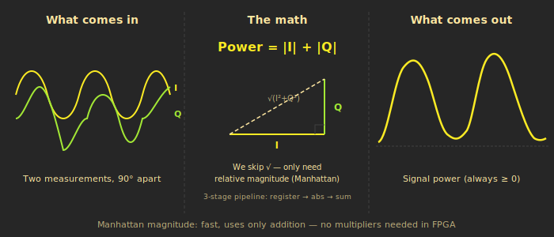
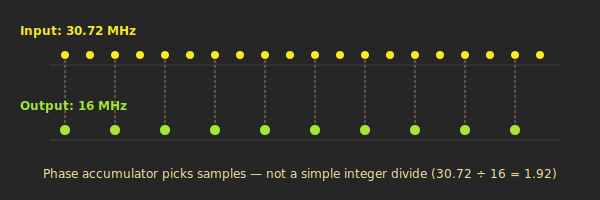
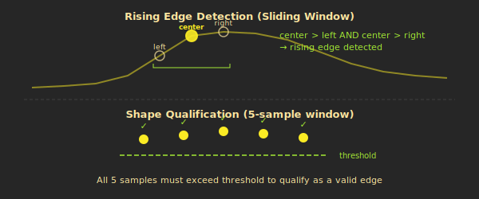

# The Signal Processing Front-End

Before we can look for aircraft messages, we need to turn raw radio samples into something meaningful. This page covers the three stages that prepare the signal: power computation, rate conversion, and edge detection.

These three modules sit between the AD9363 radio and the preamble detector. Their job is to transform a stream of complex radio samples into a clean, rate-normalised power signal with rising edges flagged --- exactly what the preamble detector needs to find Mode-S transmissions.

---

## What the AD9363 gives us

The AD9363 software-defined radio front-end tunes to 1090 MHz and outputs digital samples at 30.72 MHz. But these are not simple signal-strength numbers --- they are **I/Q samples**.

---

## What are I/Q samples?

> Imagine two microphones pointed at a speaker, positioned so one hears the signal a quarter-cycle behind the other. That's I/Q --- two simultaneous measurements of the same signal, 90 degrees apart. I captures one component, Q the other. Together they completely describe the signal. For ADS-B we only care about strength, so we combine I and Q into power.

Every radio receiver must deal with the fact that a radio signal has both amplitude (how strong) and phase (where in its cycle). A single measurement per time step cannot capture both. The solution, used by virtually all modern digital radios, is to sample the signal twice simultaneously with a 90-degree offset:

- **I (in-phase):** The component aligned with a reference oscillator
- **Q (quadrature):** The component 90 degrees behind

Each I and Q value is a signed integer (12 bits from the AD9363 ADC, packed into 16-bit transport words). At 30.72 MHz, that is 30.72 million I/Q pairs per second flowing into the FPGA.

For ADS-B, the message content is encoded in signal amplitude, not phase. We do not need to track the carrier's phase --- we just need to know how strong the signal is at each moment. That means we can collapse the two-dimensional I/Q representation into a single scalar: **power**.



---

## Computing power --- I squared plus Q squared

The standard formula for instantaneous power from I/Q samples is:

```
power = I^2 + Q^2
```

This is the squared magnitude of the complex sample. We deliberately skip the square root (which would give amplitude) because we only need *relative* levels --- is this sample stronger than that one? Squaring preserves the ordering, and the FPGA does not have to spend resources on a square root circuit.

### The FPGA pipeline

The `iq_to_power` module computes this in a 3-stage pipeline:

| Stage | Operation | Details |
|-------|-----------|---------|
| 0 | Register inputs | Latch the incoming I and Q samples. Only the real 12-bit ADC payload is kept --- the 4 sign-extension bits are discarded. This keeps the downstream multipliers small. |
| 1 | Multiply | Compute I x I and Q x Q using the FPGA's dedicated DSP multiplier blocks. Two 12-bit signed multiplications produce 24-bit results. |
| 2 | Sum and scale | Add the two squared terms. The worst-case result (both I and Q at full scale) can slightly exceed the signed 24-bit range, so the sum is right-shifted by 2 to guarantee the output stays non-negative. Final output: 24 bits, signed. |

Each stage takes one clock cycle. New I/Q pairs flow in continuously, and power values flow out three cycles later. The pipeline processes one sample per clock cycle at full throughput --- no stalls, no buffering.

> **Why signed output for a non-negative value?** The downstream decode pipeline was originally designed around signed arithmetic for the power signal path. Keeping the output signed avoids changing every comparison and threshold in the decoder. The values are always non-negative in practice; the sign bit simply provides headroom.

---

## Rate conversion --- 30.72 MHz to 16 MHz

The decode pipeline expects samples at exactly 16 MHz. The AD9363 delivers 30.72 MHz. We need to downsample.

### Why 16 MHz?

ADS-B uses a 1 MHz chip rate (each half-bit "chip" is 0.5 microseconds). At 16 MHz, we get **16 samples per bit period** and **8 samples per chip**. These clean integer ratios simplify every part of the decoder: preamble correlation windows, bit-sampling positions, and buffer sizes all work out to exact sample counts with no fractional offsets.

### The problem with simple downsampling

The ratio 30.72 / 16 = 1.92. This is not an integer. We cannot simply "keep every Nth sample" because there is no integer N that gives us 16 MHz from 30.72 MHz. Keeping every 2nd sample would give 15.36 MHz --- close, but wrong enough to gradually shift the bit-sampling positions and break preamble detection.

### Phase accumulator approach

The `power_downsampler` module uses a **phase accumulator** --- a counter that tracks fractional position through the input stream and emits an output sample whenever the accumulated phase crosses a threshold.



Think of it as two metronomes ticking at different rates. The input metronome ticks at 30.72 MHz. The output metronome ticks at 16 MHz. On every input tick, the accumulator adds the output rate (16,000,000) to a running counter. Whenever the counter exceeds the input rate (30,720,000), it wraps around and emits the current input sample as an output.

```
On each input sample:
    phase += 16,000,000
    if phase >= 30,720,000:
        phase -= 30,720,000
        emit current sample as output
```

This produces output samples at an average rate of exactly 16 MHz, with the inter-sample spacing alternating between 1 and 2 input periods to maintain the correct long-term rate. The implementation is a single process with one integer comparison --- zero multipliers, zero DSP blocks.

> **Nearest-sample selection:** This is not interpolation. The downsampler picks the nearest available input sample at each output position. For ADS-B, where pulses are 0.5 microseconds wide (8 samples at 16 MHz), the sub-sample timing error introduced by nearest-sample selection is negligible.

---

## Edge detection

The final front-end stage identifies **rising edges** in the power signal. These mark the leading transitions of pulses in the Mode-S preamble and data encoding.

Why edges? The Mode-S preamble consists of 4 pulses at specific positions. The preamble detector needs to know where pulses begin, not just where power is high. A rising edge marks the start of a pulse --- the transition from quiet to signal.



### How it works

The `adsb_edge_detector` module uses a 9-sample sliding window (SPS + 1 = 8 + 1) to detect rising transitions. Two conditions must be met:

**1. Three-point slope test.** A center tap sample is compared against its immediate neighbours:

- Center > previous sample (signal is increasing)
- Center < next sample (signal is still increasing)

This identifies points on a monotonically rising slope --- the inflection point where a pulse is ramping up. Single noise spikes fail this test because they are higher than *both* neighbours.

**2. Shape qualification.** All 5 samples in a qualifying window around the center tap must exceed `EDGE_POWER_THRESHOLD` (set to 100, well above noise floor). The module converts the threshold-exceedance pattern to a bitmask and requires the specific pattern `11111` --- all 5 samples above threshold. Partial patterns (4 of 5 or fewer) are rejected.

Both conditions must pass simultaneously. The slope test rejects noise; the threshold test rejects weak interference. Together, they eliminate the vast majority of false edges while preserving real pulse transitions.

### Pipeline alignment

The edge detector introduces a small pipeline delay (equal to the buffer length) to align its outputs. The `power_out` and `edge_out` signals are time-aligned: when `edge_out` is high, the corresponding `power_out` value is the sample at which the rising edge was detected. The downstream preamble detector receives both signals in lockstep.

---

> **What we have built so far:** RF radio signal --> digital I/Q samples --> scalar power --> 16 MHz stream --> edge-flagged samples. This is a clean, rate-normalised, edge-annotated power signal at exactly 16 million samples per second. This is exactly what the preamble detector needs to begin searching for Mode-S transmissions.

---

**Previous:** [<-- System Overview](02-System-Overview) | **Next:** [Preamble Detection -->](04-Preamble-Detection)
