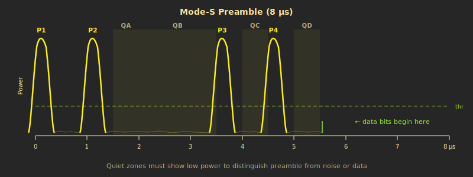
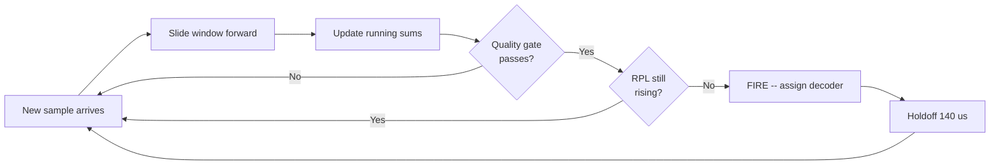
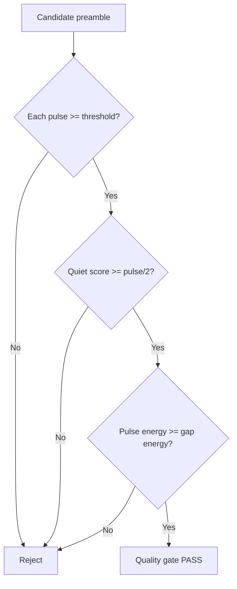
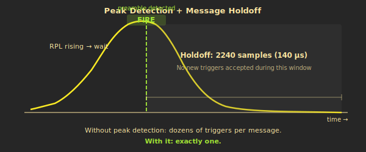

# Preamble Detection -- Finding Messages in Noise

The airwaves at 1090 MHz are a chaotic mix of aircraft transponder signals, noise, and interference. Every ADS-B message starts with a distinctive 8-microsecond preamble -- four pulses in a specific pattern. The preamble detector's job is to find these patterns in real-time, reject false alarms, and hand off each message to a decoder.

This page walks through how the detector works, starting with the pattern it's looking for, then the algorithm it uses to find it, and finally how it decides when to fire.

---

## The Mode-S Preamble

Every Mode-S transmission -- whether it's an ADS-B position report, an altitude reply, or an identity squawk -- begins with the same 8-microsecond preamble. It's like a knock pattern on a door: "tap-tap ... tap-tap." That distinctive rhythm says "a message follows."

The preamble contains four short pulses at specific positions:

| Pulse | Time     | Purpose                        |
|-------|----------|--------------------------------|
| P1    | 0.0 us   | First pulse of the opening pair |
| P2    | 1.0 us   | Second pulse of the opening pair |
| P3    | 3.5 us   | First pulse of the closing pair  |
| P4    | 4.5 us   | Second pulse of the closing pair |

Between the pulses are **quiet zones** -- gaps where the signal should be near zero. The contrast between loud pulses and quiet gaps is what makes the preamble recognizable. After the preamble ends at 8 us, the data payload begins.

At our 16 MHz sample rate, the 8 us preamble spans exactly **128 samples**. Each pulse occupies about 8 samples (0.5 us), and the quiet zones fill the spaces between.

---

## Sliding-Window Correlation

The detector continuously looks at the most recent 128 samples and asks: "does this look like a preamble?"

Think of it like holding a transparent template over a strip of graph paper and sliding it one position at a time. The template has marks at the four pulse positions. At each position, you check: are there strong signals where the marks are, and silence in between?

In hardware, this works as a **128-sample shift register**. As each new power sample arrives from the radio frontend, it enters one end of the register and the oldest sample falls off the other end. Eight running accumulators -- four for the pulse windows and four for the quiet zones -- are updated incrementally. When a sample enters a window, its value is added. When a sample leaves, its value is subtracted. This means each update costs just one add and one subtract per accumulator, regardless of window size.

The pulse windows are 5 samples wide, centered on each expected pulse position. The quiet zone windows are also 5 samples wide, placed in the gaps between pulses.

This happens **16 million times per second** -- once for every sample.

---

## The Quality Gate

Not everything that has four bumps is a preamble. Noise, interference from other transmitters, and even the data payload of other messages can create patterns that vaguely resemble pulses. The quality gate is a series of three checks that a candidate must pass before it's considered a real preamble. All three must pass simultaneously.

### Check 1: Pulse Threshold

Each of the four pulse sums must exceed a minimum power level (`POWER_THRESHOLD`, currently 2000). This is the coarsest filter -- it eliminates candidates where the signal is so weak it could just be background noise. If any of the four pulse sums falls below the threshold, the candidate is immediately rejected.

### Check 2: Quiet Zone Contrast (Score-Based)

The four gaps between and around the pulses should be quieter than the pulses themselves. But rather than demanding perfection from every single gap, the detector uses a **scoring system**.

For each of the four quiet zones, the detector computes:

    zone_contrast = adjacent_pulse_sum - quiet_zone_sum

If the quiet zone is indeed quiet, this difference is large and positive. If the quiet zone has noise or a reflection in it, the difference is small or negative.

All four zone contrasts are summed into a single **quiet score**. The gate passes if the total quiet score exceeds half the total pulse energy. In other words, the detector asks: "on balance, are the gaps mostly quiet?"

> **Why score-based?** Early versions used a hard veto -- if *any* quiet zone was too loud, the message was rejected. Real signals often have noise or reflections in one zone. A nearby aircraft might overlap in one gap, or multipath reflections off a building can fill a single quiet zone with energy. The score-based approach allows one noisy zone if the other three are clean. This single change took detection from ~50% to ~99% on real hardware, with zero increase in false positives.

### Check 3: SNR Gate

The aggregate pulse energy (sum of all four pulse accumulators) must be greater than or equal to the aggregate gap energy (sum of all four quiet zone accumulators). This is a coarse signal-to-noise ratio check that catches cases where individual pulse sums pass the absolute threshold but the overall signal doesn't stand out from the background.

A secondary guard requires the total gap energy to be non-negative, catching rare overflow artifacts in the accumulator arithmetic.

---

## Peak Detection -- One Trigger Per Message

The quality gate doesn't fire once and stop. As a real preamble slides through the 128-sample buffer, there are typically **many consecutive positions** where the gate passes -- the signal is present for several samples before and after the optimal alignment. Without additional logic, a single preamble would fire dozens of times, consuming all available decoders with copies of the same message.

The solution is **peak detection**. The detector tracks the RPL (Reference Power Level -- the average strength of the four pulse windows) across consecutive qualifying cycles. As the preamble slides into better alignment, RPL rises. As it slides past optimal alignment, RPL declines. The detector fires only at the moment RPL starts declining -- the local maximum, which corresponds to the best possible alignment.

Here's how it works in practice:

1. When the quality gate first passes, the detector opens a **candidate window** and records the current RPL and timestamp.
2. On each subsequent passing cycle, if the new RPL is higher, the candidate is updated (better alignment found).
3. When RPL drops while the gate still passes, or when the gate stops passing entirely, the detector fires using the best candidate it recorded.

After firing, the detector enters a **holdoff period** of 2,240 samples (140 us). This covers the full length of an extended Mode-S message, preventing the data payload from re-triggering the detector as it passes through the correlator buffer. The tradeoff is that a genuinely overlapping preamble arriving within 140 us of the first will be missed -- the same tradeoff that software decoders like dump1090 make.

---

## Decoder Assignment

When the preamble detector fires, it needs to hand the message off to one of 8 parallel decoder slots. The assignment uses a **first-free strategy**: scan slots 0 through 7 in order and assign to the first one that isn't busy.

Each decoder takes up to 140 us to process a message (less for short frames -- see [Decoding and Error Correction](05-Decoding-and-Error-Correction.md)). With 8 parallel decoders, the system can handle up to 8 overlapping transmissions. Near busy airports, this matters -- aircraft on approach are often transmitting simultaneously, and their messages arrive interleaved at the receiver.

If all 8 decoders are busy when a new preamble fires, the detection is dropped. A hardware counter tracks these events for diagnostics.

There's one more subtlety: if two preambles fire close together, the stronger one wins. The detector compares RPL values and only assigns a new detection if it's stronger than any pending assignment.

---

## Timestamp Capture -- Nanosecond Precision for MLAT

> At the exact clock cycle when the preamble detector fires, the current value of the 64-bit free-running timestamp counter is latched as the **Time-of-Arrival (TOA)**. At 100 MHz, this gives 10-nanosecond resolution. The TOA follows the message through the entire decode pipeline -- from the preamble detector to the BSD calculator to the bit flipper to the Linux host -- where it's formatted into the Beast binary protocol for MLAT processing.
>
> Multilateration (MLAT) works by comparing the arrival time of the same message at multiple receivers. The difference in arrival times reveals the distance difference to the aircraft, and with 3+ receivers, the aircraft's position can be computed. This only works if the timestamp is captured at the moment of detection, not after processing delays. That's why the latch happens right here, at the point of preamble detection, before any variable-latency decode work begins.

---

**Previous:** [Signal Processing Front-End](03-Signal-Processing-Front-End.md) | **Next:** [Decoding and Error Correction](05-Decoding-and-Error-Correction.md)
