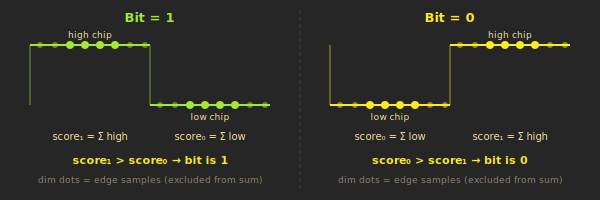
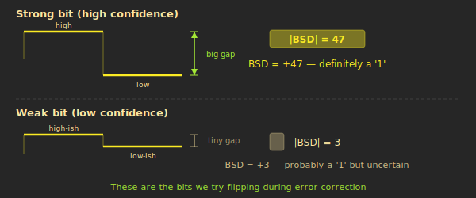
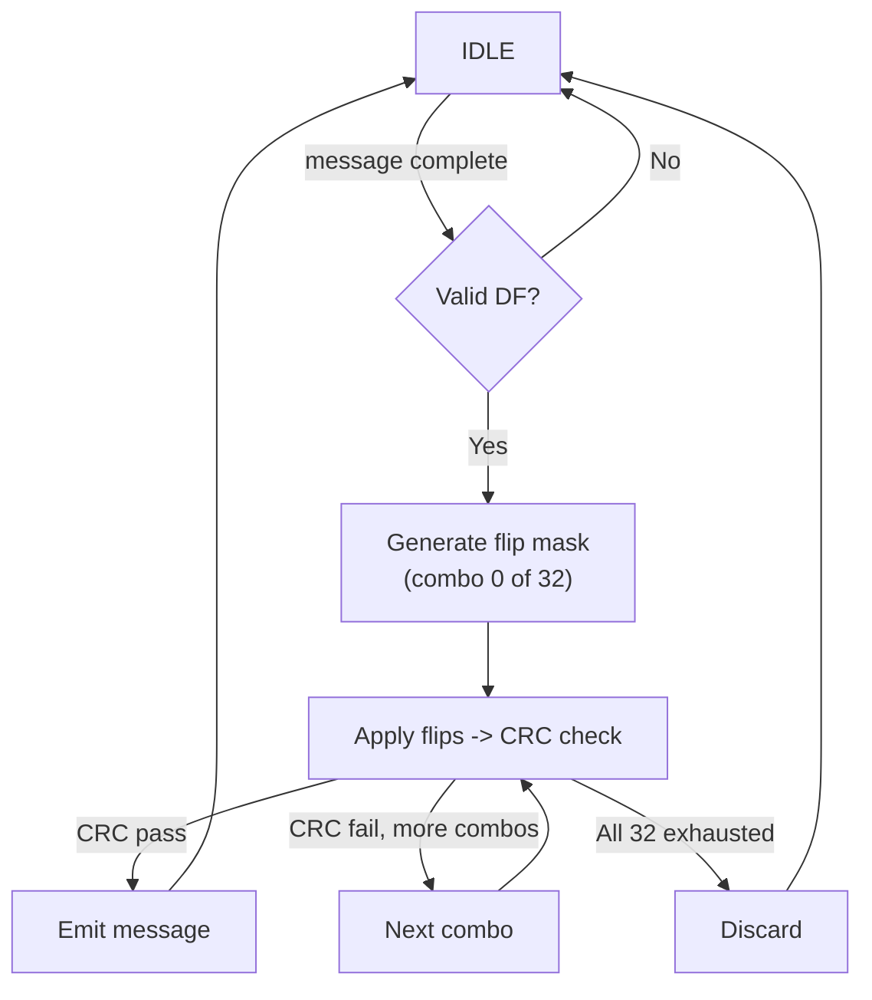

# Decoding and Error Correction

Once the preamble detector fires and assigns a decoder, we have 112 bits (or 56 for short messages) of data to extract from the signal. Each bit is encoded as a pair of pulses, and noise can make some bits ambiguous. This page explains how we demodulate the bits, score our confidence in each one, and use brute-force error correction to fix mistakes.

---

## PPM -- How Bits Are Encoded

Mode-S uses **Pulse Position Modulation (PPM)**. Each data bit occupies 1 microsecond, divided into two half-microsecond "chips" of 8 samples each (16 samples per bit at our 16 MHz sample rate).

The rule is simple:

- **Bit '1'**: high chip first, low chip second (pulse then silence)
- **Bit '0'**: low chip first, high chip second (silence then pulse)

It's the *position* of the pulse within the bit period that encodes the value -- hence the name. This scheme is self-clocking and resistant to amplitude variations, since only the relative position matters, not the absolute power level.

---

## Soft Decisions -- How Confident Are We?

A naive decoder would look at each bit and simply ask: "is the first chip louder than the second?" That gives you a hard 1 or 0. But it throws away valuable information about *how certain* that decision is.

The BSD (Bit Soft-Decision) calculator does better. For each bit, it computes separate scores for each chip, then reports both the **hard decision** (which chip was stronger) and a **confidence score** (how much stronger).

### How It Works

For each of the 16 samples in a bit period, the calculator classifies the sample relative to the RPL (Reference Power Level captured during preamble detection):

- **Type A** ("signal present"): sample is within a band around RPL -- between 50% and 250% of RPL
- **Type B** ("quiet/noise"): sample is well below RPL -- less than about 6% of RPL
- **Neither**: ambiguous samples that don't clearly belong to either class are ignored

The edge samples -- the first 2 and last 2 of each 8-sample chip -- are excluded entirely (given weight 0). These fall in the transition zone between chips, where the signal is ramping up or down and carries no reliable information. Only the **center 4 samples** (indices 2-5) of each chip contribute to the score.

The scores are accumulated across both chips:

    score1 = (typeA in chip A) - (typeA in chip B) - (typeB in chip A) + (typeB in chip B)
    score0 = the complement (swap chip A and chip B)

The final BSD = score1 - score0. A positive BSD means "probably a 1 bit." A negative BSD means "probably a 0 bit." The magnitude |BSD| is the confidence. A BSD of +8 means "definitely a 1." A BSD of +1 means "probably a 1, but I'm not sure."

> **RPL-relative weighting.** The thresholds for type A and type B classification are derived from the RPL measured during preamble detection, using only bit-shifts and adds (no hardware multiplier needed). Samples near the expected power level are counted as "signal present." Samples far above RPL might be interference from another aircraft; samples far below might be noise. By anchoring everything to the measured preamble strength, the calculator adapts automatically to each message's signal level.

---

## Finding the 5 Weakest Bits

As each BSD arrives from the calculator, a module called `smallest_bsds` maintains a **running ranking** of the 5 bits with the smallest |BSD| values -- the bits we're least confident about, and therefore the most likely to be wrong.

This is implemented as a real-time insertion sort. When a new BSD arrives:

1. Compare its absolute value against each of the 5 ranked slots
2. If it's smaller than any existing entry (or a slot is empty), insert it at that position
3. Shift everything below it down by one (the weakest entry at the bottom falls off)

This runs in constant time per bit -- 5 comparisons regardless of message length.

The module maintains **two independent rankings**:

- **Extended ranking**: tracks all 112 bit positions (for DF17/DF18 messages)
- **Short ranking**: tracks only the first 32 payload bit positions (for DF0/DF4/DF5/DF11 messages)

Why only 32 for short messages? Short frames are 56 bits total: 32 bits of payload followed by 24 bits of PI/CRC. Flipping a PI/CRC bit would be semantically wrong -- for DF11 it would change the CRC target address, and for DF0/4/5 it would alter the inferred interrogator identity.

Simultaneously, the module accumulates all 112 hard decisions into a shift register, building the complete decoded message bit by bit.

---

## Brute-Force Error Correction

This is the technique that gives commercial-grade ADS-B receivers their high decode rates.

Take the 5 weakest bits and try all 2^5 = **32 combinations** of flipping them. For each combination, run the CRC check. If the CRC passes, we've recovered the correct message. If all 32 fail, the message is unrecoverable and gets discarded.

**Iteration 0** (no flips) is tried first -- most messages have no errors and pass immediately. When there are errors, they're usually in just 1 or 2 bits, so the correct combination is typically found within the first few iterations.

Worst case: 32 iterations x ~15 clock cycles per CRC check = ~480 clocks = **30 us at 16 MHz**. This comfortably fits within the gap between messages.

This brute-force CRC/FEC path runs only for **DF11, DF17, and DF18** -- the message types where the CRC covers the full payload and where we most need reliable decode (DF17 = ADS-B position/velocity, DF18 = TIS-B, DF11 = Mode-S all-call reply). Other valid downlink formats (DF0, DF4, DF5, DF16, DF19, DF20, DF21, DF24) are forwarded as raw iter-0 candidates for the host software to validate.

> **DF validation as fast-reject.** Before entering the CRC search, the bit flipper checks the DF field (the first 5 bits of the message). If the DF doesn't match any valid Mode-S downlink format, the message is immediately discarded -- no CRC computation needed. This saves up to 30 us of decoder occupancy per false trigger and rejects roughly 73% of false preamble detections in under 1 us.

### How the Flip Mask Works

Each of the 32 iterations is represented by a 5-bit counter. Each bit of the counter corresponds to one of the 5 weakest bit positions. If counter bit *j* is 1, the 112-bit flip mask has a 1 at the position stored in `smallest[j].index`. The mask is XOR'd with the original decoded message, flipping exactly those bits. The result is fed to the CRC checker.

---

## CRC-24

Every Mode-S message ends with a 24-bit CRC (Cyclic Redundancy Check) computed using a specific polynomial (0x1FFF409, the Kasami-Matoba polynomial). A correct message, when divided by this polynomial, yields a remainder of zero.

The hardware CRC module processes **one byte per clock cycle** using an unrolled shift-and-XOR circuit. A short message (7 bytes) takes 7 clocks; an extended message (14 bytes) takes 14 clocks. No lookup tables, no multipliers -- just shifts and XORs, which synthesize into a thin layer of combinatorial logic.

One important guard: the CRC of an all-zero message is also zero. To prevent noise bursts of all zeros from passing as valid, the module tracks whether any non-zero byte has been seen. An all-zero message is always rejected.

---

## Short-Frame Early Completion

Short messages (any DF less than 16) contain only 56 bits, but the decoder pipeline is sized for the 112-bit extended format. Without special handling, a short message would tie up a decoder slot for the full 112-bit collection period -- wasting half the time on samples that aren't part of the message.

The `smallest_bsds` module detects short frames by examining the DF field as soon as 56 bits have been accumulated. If the MSB of the DF field is 0 (meaning DF is 0-15), the module immediately signals completion and frees the decoder slot. This cuts decoder occupancy roughly in half for short-frame traffic.

In busy airspace, short frames (DF0/DF4/DF5/DF11) can outnumber extended frames. Freeing decoder slots 56 bit-periods earlier significantly reduces the chance of all 8 decoders being busy when the next preamble arrives.

---

## Putting It All Together

Here's the complete journey of a single message through the decode pipeline:

1. **Preamble detected** -- quality gate passes, peak found, decoder 3 assigned, TOA latched
2. **2,240 power samples** streamed to the BSD calculator (140 us of signal)
3. **112 BSDs computed** -- one per bit, each with a confidence score and hard decision
4. **5 weakest bits identified** by running insertion sort during BSD streaming
5. **DF field checked** -- if invalid, decoder freed immediately (~1 us)
6. **Up to 32 CRC attempts** -- flip combinations of the 5 weakest bits, check CRC-24 each time
7. **CRC passes** -- message emitted with its TOA timestamp and RPL, decoder freed
8. **Message forwarded** through the async FIFO to Linux, formatted as Beast binary, sent to downstream consumers

The entire process, from preamble detection to message output, takes between 60 us (short frame, no errors, CRC passes on iteration 0) and 170 us (extended frame, all 32 iterations needed). With 8 parallel decoders, the system handles the busiest airspace without dropping messages.

---

**Previous:** [Preamble Detection](04-Preamble-Detection) | **Next:** [Timestamps and MLAT](06-Timestamps-and-MLAT)
