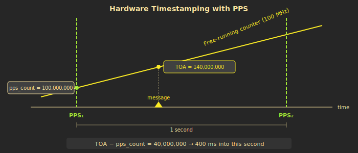

# Timestamps and MLAT

The most valuable thing about an FPGA receiver isn't decoding speed --- it's timing precision. Every message gets a hardware timestamp accurate to one clock cycle (62.5 nanoseconds). This enables MLAT (multilateration) --- determining an aircraft's position from the time differences measured by multiple receivers.

---

## The free-running counter

At the heart of the timing system is a 64-bit counter that increments on every tick of the 16 MHz sample clock. One tick = 62.5 nanoseconds. The counter starts at zero when the FPGA powers up and counts upward, continuously, forever.

64 bits at 16 MHz means the counter won't roll over for approximately 36,559 years. For all practical purposes, it never wraps.

By itself, the counter value is meaningless. If you read 4,800,000,000, that tells you "4.8 billion clock cycles since power-on" --- but you have no idea what time of day that corresponds to. The counter is a ruler with no reference point.

That's what PPS is for.

---

## PPS --- anchoring to real time

A GNSS (GPS) receiver module connected to the FPGA provides a PPS signal --- Pulse Per Second. This is a single digital pulse that goes high once per second, with its rising edge precisely aligned to a UTC second boundary. GNSS timing is accurate to tens of nanoseconds.

When the FPGA sees the PPS rising edge, it latches the current counter value into a register called `counter_at_pps`. Now we have a fixed anchor: "this counter value corresponds to the start of a UTC second."

But there's a subtlety. The PPS signal comes from the GNSS module, which runs on its own clock. It is completely asynchronous to the FPGA's 16 MHz sample clock. The PPS edge could arrive at the exact moment the FPGA clock ticks, which would create a condition called metastability --- the flip-flop's output would hover between 0 and 1 in an undefined state, potentially corrupting downstream logic.

The solution is a **double-flop synchroniser**: two flip-flops connected in series. The raw PPS signal enters the first flip-flop, which might go metastable. By the time that value propagates through the second flip-flop one clock cycle later, it has settled to a clean 0 or 1. A third stage detects the rising edge (previous value was 0, current value is 1) and triggers the counter latch.

> **For software engineers:** The double-flop synchroniser is like a mutex for a single bit crossing between clock domains. The raw PPS could change at the exact moment our clock ticks --- "metastability" can corrupt logic. Two back-to-back flip-flops reduce the probability of metastable output propagating to once in millions of years.

---

## Time-of-arrival (TOA)

When the preamble detector identifies an ADS-B message, it latches the current counter value at that instant. This is the **Time-Of-Arrival** (TOA) --- the exact clock cycle when the message's preamble was detected.

Converting TOA to a real-world time is straightforward:

```
nanoseconds_since_pps = (TOA - counter_at_pps) * 62.5
```

The Linux software knows which UTC second the last PPS edge corresponded to (from NTP), so the full timestamp becomes:

```
absolute_time = UTC_second + nanoseconds_since_pps
```

Because both the TOA latch and the PPS latch reference the same free-running counter, the subtraction cancels out any power-on offset. It doesn't matter when the FPGA started or what the counter's absolute value is --- only the difference matters.



---

## Beast timestamp format

The Beast binary protocol --- the standard output format for ADS-B receivers --- uses a 48-bit timestamp field. By industry convention, this field represents a counter running at 12 MHz.

plane_watcher's FPGA runs at 16 MHz, so the Go software on the Linux side scales the counter before encoding:

```
ts_12mhz = counter_16mhz * 3 / 4
```

In **standard mode**, this 48-bit value is simply the scaled free-running counter, truncated to 48 bits. Downstream consumers treat it as an opaque monotonic counter for relative timing between messages.

In **Radarcape mode** (an extended convention used by many MLAT servers), the 48 bits are split into structured fields:

| Bits | Field | Description |
|------|-------|-------------|
| 47 | GPS sync flag | 1 = timestamp is GPS-disciplined |
| 46:30 | Seconds since midnight | 17 bits, from NTP-disciplined system clock via PPS |
| 29:0 | Sub-second fraction | 30 bits, nanoseconds from FPGA counter delta |

The upper field comes from software (NTP provides second-level accuracy). The lower field comes from hardware (the counter difference against the PPS latch provides nanosecond precision). This hybrid approach gives the best of both worlds: absolute UTC alignment from NTP and sub-microsecond precision from the FPGA.


---

## MLAT --- position from time

If receiver A hears a Mode-S message 100 ns before receiver B, that means the aircraft is closer to A. How much closer? Radio signals travel at the speed of light: roughly 300 metres per microsecond, or 30 metres per 100 nanoseconds.

The time difference between two receivers defines a **hyperboloid** --- a curved surface of constant distance difference. Add a third receiver, and you get a second hyperboloid. The intersection of those surfaces is a curve. A fourth receiver (or altitude information) narrows it to a point: the aircraft's position.

This is GPS in reverse. With GPS, satellites at known positions broadcast at known times, and your phone solves for its own position. With MLAT, receivers at known positions measure arrival times from an unknown aircraft, and a central server solves for the aircraft's position.

MLAT is especially valuable for tracking aircraft that carry Mode-S transponders but do not broadcast ADS-B position --- older aircraft, military traffic, and general aviation. These aircraft reply to radar interrogations (DF0, DF4, DF5, DF11), and those replies carry enough information for identification and altitude. MLAT adds the missing position.

See the [MLAT geometry illustration](01-What-is-ADS-B#what-is-mlat) on the ADS-B basics page.

---

## Precision comparison

The quality of MLAT position fixes depends directly on timestamp precision. Here's how plane_watcher compares to a typical software receiver:

| Receiver type | Timing precision | Position contribution |
|--------------|-----------------|----------------------|
| RTL-SDR + software | ~1 us (OS scheduling jitter) | ~300 m |
| plane_watcher FPGA | ~62.5 ns (1 clock cycle) | ~19 m |

The RTL-SDR's limitation isn't the hardware --- it samples at 2 MHz with reasonable precision. The problem is the path from USB dongle to software decoder. The USB transfer happens in chunks. The operating system schedules the decoder process alongside other tasks. Interrupt handling, context switches, and buffer latency all add jitter that is orders of magnitude larger than the sample period.

The FPGA has none of these layers. The preamble detector latches the counter in the same clock cycle it fires. There is no bus transfer, no OS scheduling, no buffering delay. The timestamp *is* the clock cycle the preamble was detected.

> **This is the whole point of the project.** Software receivers work fine for ADS-B (the aircraft sends its position). But for MLAT, timing precision directly translates to position accuracy --- and the FPGA gives us 16x better precision than what software on a general-purpose computer can achieve.

---

**Previous:** [Decoding and Error Correction](05-Decoding-and-Error-Correction) | **Next:** [From FPGA to Network](07-From-FPGA-to-Network)
