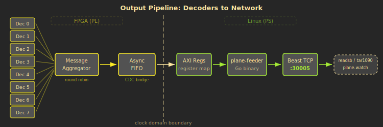
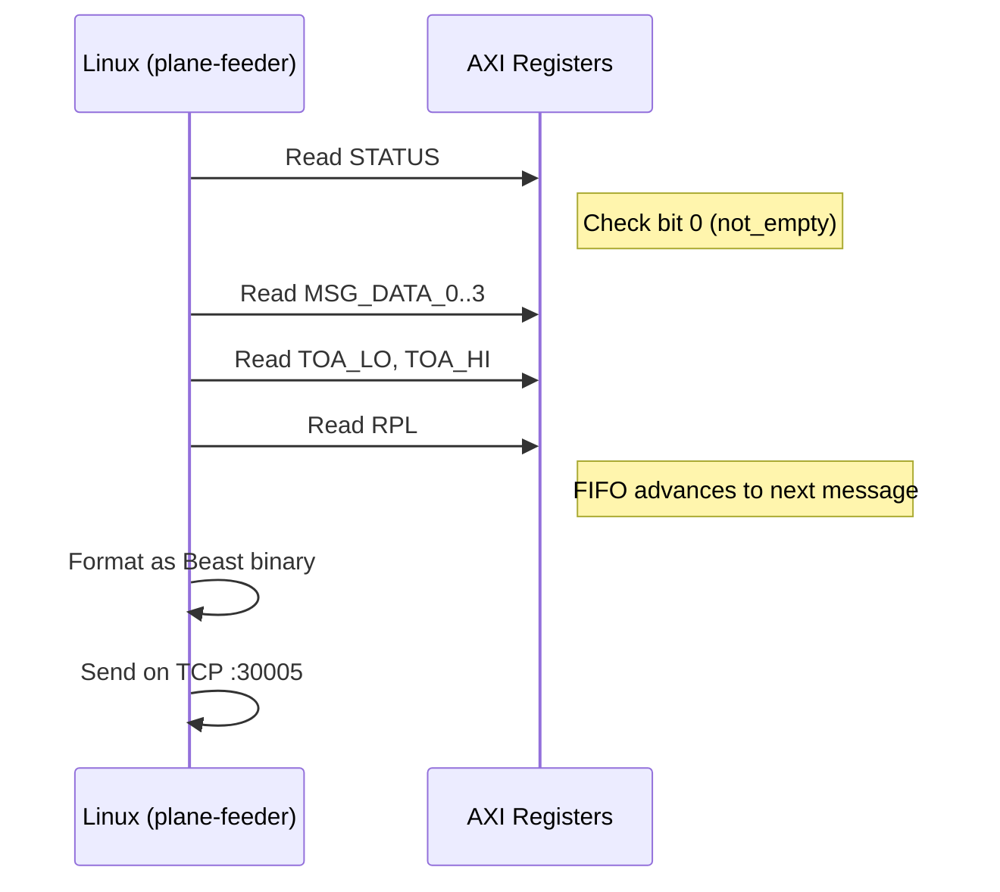

# From FPGA to Network

A decoded ADS-B message inside the FPGA isn't useful until it reaches the network. This page covers the output path: how messages are collected from 8 parallel decoders, cross the clock domain boundary into Linux, and get formatted for network distribution.

---

## Message aggregator

The 8 parallel decoders work independently. Each one processes its own message on its own timeline --- they start at different times, take different numbers of CRC iterations, and finish whenever they finish. The **message aggregator** collects their outputs into a single, ordered stream.

Each decoder has a dedicated **holding register** inside the aggregator. When a decoder finishes and asserts its valid signal, the message, TOA (Time-Of-Arrival), and RPL (Reference Power Level) are captured into that decoder's holding slot --- provided the slot is empty. If the slot is still occupied from a previous message that hasn't been read yet, the new message is dropped (this is rare in practice, because the arbiter reads slots much faster than decoders produce messages).

A **round-robin arbiter** cycles through all 8 holding slots, one per clock cycle. When it finds an occupied slot, it outputs the message and clears the slot. The output is a single stream: 112-bit message + 64-bit TOA + 24-bit RPL, with a valid strobe.

A **packet timeout** mechanism (approximately 20 ms at 16 MHz) ensures regular output even during quiet periods. If no real messages arrive before the timer expires, the aggregator emits zero-padded frames to maintain downstream framing.

---

## Clock domain crossing --- the async FIFO

The decode pipeline runs on a 16 MHz sample clock, derived from the AD9363 radio frontend. The Linux-facing AXI register interface runs on the Zynq's 100 MHz FCLK_CLK0 clock. These two clocks are completely unrelated --- they come from different oscillators and have no fixed phase relationship.

You cannot simply share a memory buffer between two unrelated clocks. A write from one clock domain could arrive at the exact moment the other domain is reading, producing corrupted data. This is the hardware equivalent of a data race.

The **async FIFO** (asynchronous FIFO) solves this with a well-established technique:

> **For software engineers:** This is a thread-safe queue between a producer (16 MHz) and a consumer (100 MHz). The two clocks are like two threads that can never synchronise --- reads and writes could collide at any moment. You can't just share memory. The async FIFO is the hardware equivalent of a lock-free concurrent queue.

**Gray-coded pointers** are the key mechanism. Both the write pointer and the read pointer are maintained in Gray code --- a binary encoding where only a single bit changes between consecutive values. This property is critical: when a pointer crosses the clock domain boundary through a 2-flip-flop synchroniser, even if the synchroniser catches the pointer mid-transition, only one bit is in flight. The worst case is reading the old value (one entry behind), never a corrupted value.

The FIFO stores **64 entries**, each **200 bits wide** (112 bits of message + 64 bits of TOA + 24 bits of RPL). Storage is implemented in block RAM to keep it off the critical timing path.

An **overflow** sticky bit is set if the write side attempts to push when the FIFO is full. This is exposed in the STATUS register so Linux can detect lost messages.

---

## AXI register interface

The Linux ARM cores on the Zynq access FPGA logic through **AXI4-Lite**, a memory-mapped bus protocol. From Linux's perspective, the FPGA's registers appear as ordinary memory addresses. The `plane-feeder` Go binary reads them via `/dev/mem` (memory-mapped I/O).

The register map occupies a 64-byte window starting at base address `0x43D00000`:

| Offset | Name | Access | Description |
|--------|------|--------|-------------|
| 0x00 | MSG_DATA_0 | Read | Message bits [31:0] |
| 0x04 | MSG_DATA_1 | Read | Message bits [63:32] |
| 0x08 | MSG_DATA_2 | Read | Message bits [95:64] |
| 0x0C | MSG_DATA_3 | Read | Message bits [111:96] (upper 16 bits zero) |
| 0x10 | TOA_LO | Read | Timestamp lower 32 bits |
| 0x14 | TOA_HI | Read | Timestamp upper 32 bits |
| 0x18 | RPL | Read | Signal level --- **reading pops the FIFO** |
| 0x1C | STATUS | Read | [0]=not_empty, [1]=full, [2]=overflow, [14:8]=fill count |
| 0x20 | PPS_COUNT | Read | PPS edges since reset |
| 0x24 | PPS_CTR_LO | Read | Counter at last PPS [31:0] |
| 0x28 | PPS_CTR_HI | Read | Counter at last PPS [63:32] |
| 0x2C | CONTROL | R/W | [0]=soft_reset, [1]=enable |
| 0x30 | VERSION | Read | Hardware version |
| 0x34 | DBG_INDEX | R/W | Debug counter selector |
| 0x38 | DBG_DATA | Read | Selected debug counter value |
| 0x3C | CONFIG | R/W | Runtime-tunable parameters |

All registers on the read side reflect the message currently at the **head** of the FIFO. They do not change until the FIFO is popped.

---

## The FIFO pop protocol

Reading a message from the FIFO requires a specific sequence. The registers are a window into the FIFO's head entry, and reading RPL (offset 0x18) is the action that advances to the next entry.

The protocol is:

1. **Check STATUS** --- bit 0 (not_empty). If clear, the FIFO is empty; sleep and retry.
2. **Read MSG_DATA_0 through MSG_DATA_3** --- the 112-bit message payload, split across four 32-bit registers.
3. **Read TOA_LO and TOA_HI** --- the 64-bit timestamp, split across two 32-bit registers.
4. **Read RPL** --- the 24-bit signal level. **This read pops the FIFO.** The head pointer advances, and the registers now reflect the next message (or the FIFO goes empty).
5. **Repeat from step 1.**

> **Why does RPL pop the FIFO?** The registers are a stable window into whichever message is at the FIFO head. Reading RPL last ensures you've captured all fields before the window advances. If RPL were read first, the FIFO would pop before you'd read the timestamp or message data --- you'd get fields from two different messages.

---

## plane-feeder --- the Go binary

`plane-feeder` is the Go program that runs on the Zynq's ARM Linux and bridges the gap between FPGA hardware and the network.

Its main loop is straightforward:

1. **Poll** the STATUS register in a tight loop (with a 100-microsecond sleep when the FIFO is empty).
2. **Read** registers using the pop protocol described above.
3. **Decode** the raw register values into a Mode-S message (reversing the FPGA's byte ordering).
4. **Validate** the downlink format. For DF11/17/18, the ICAO address is added to a seen-address cache. For address/parity formats (DF0/4/5), the CRC remainder is checked against the cache --- if the address hasn't been seen recently, the message is dropped to avoid forwarding noise.
5. **Encode** the message as a Beast binary frame.
6. **Broadcast** the frame to all connected TCP clients on port 30005.

plane-feeder also runs a web dashboard on port 8080 showing message rates, ICAO counts, PPS status, and debug counters.

---

## Beast binary frame format

Beast binary is the standard wire format for distributing Mode-S messages between ADS-B tools. Every frame follows this structure:

| Field | Size | Description |
|-------|------|-------------|
| Escape | 1 byte | `0x1A` --- frame start marker |
| Type | 1 byte | `0x32` (short, 56-bit message) or `0x33` (extended, 112-bit message) |
| Timestamp | 6 bytes | 48-bit timestamp (12 MHz convention or Radarcape UTC format) |
| Signal | 1 byte | Signal level (RSSI), sqrt-scaled for dBFS display |
| Message | 7 or 14 bytes | Raw Mode-S payload |

**Byte stuffing:** If the byte `0x1A` appears anywhere in the payload (type, timestamp, signal, or message fields), it is doubled to `0x1A 0x1A`. The leading escape byte is never doubled. This ensures the receiver can unambiguously find frame boundaries by looking for a lone `0x1A`.

The timestamp encoding depends on the mode. In **standard mode**, the 48-bit field is the FPGA counter scaled from 16 MHz to 12 MHz (`counter * 3 / 4`). In **Radarcape mode**, the field encodes structured UTC time: a GPS-sync flag, seconds since midnight, and a 30-bit nanosecond fraction derived from the FPGA counter's offset from the last PPS edge. See [Timestamps and MLAT](06-Timestamps-and-MLAT) for details.

---

## Feeding the ecosystem

Once plane-feeder is serving Beast TCP on port 30005, the standard ADS-B software ecosystem connects directly:

- **readsb / dump1090** connects as a Beast TCP client for local decoding and aggregation.
- **tar1090** provides a web-based map interface showing aircraft positions, trails, and metadata.
- **plane.watch**, **ADS-B Exchange**, and other aggregators pull data for their global flight tracking networks.
- **mlat-client** correlates plane_watcher's nanosecond-precision timestamps with those from other receivers in the network to compute positions for non-ADS-B aircraft.

The MLAT path is where the FPGA's timing precision pays off. mlat-client reads the Beast timestamps, compares them against timestamps from other receivers for the same transmission, and feeds the time differences to a central MLAT server that solves for position. The better the timestamps, the better the position fixes.

> **The complete path:** Radio waves hit the antenna. The AD9363 digitises the 1090 MHz signal. The FPGA detects preambles, runs 8 parallel decoders with error correction, timestamps each message to the clock cycle, and pushes results through an async FIFO. Linux reads the FIFO, formats Beast binary frames, and serves them on TCP port 30005. Flight trackers and MLAT servers connect and consume the data. All with nanosecond timestamps, from antenna to network, in under 200 microseconds.

---

**Previous:** [Timestamps and MLAT](06-Timestamps-and-MLAT) | **Home:** [Back to index](Home)
