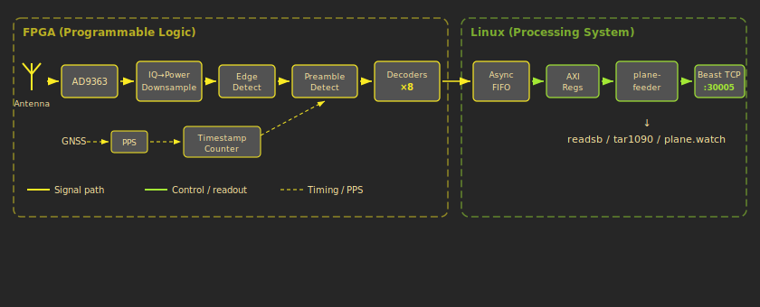

# plane_watcher --- FPGA ADS-B Receiver

An open-source ADS-B receiver built on FPGA hardware. Instead of decoding aircraft signals in software, this project does it in programmable logic --- giving us deterministic timing for MLAT, parallel decoding of overlapping messages, and hardware-precision timestamps.

The system runs on a Zynq-7020 SoC, which combines FPGA fabric with dual ARM Cortex-A9 cores on a single chip. The FPGA handles the real-time signal processing (preamble detection, 8 parallel decoders, CRC-based error correction, nanosecond timestamping). The ARM side runs Linux and a Go binary that reads decoded messages from the FPGA and serves them as Beast TCP on port 30005 --- ready for any standard flight tracker or MLAT network.

---

## What you'll learn

This documentation walks through every stage of the receiver, from the radio signal hitting the antenna to decoded aircraft positions appearing on your screen. No FPGA experience required --- we start from scratch and build intuition before introducing technical detail.

---

## Reading order

| # | Page | You'll understand... |
|---|------|---------------------|
| 1 | [What is ADS-B?](01-What-is-ADS-B.md) | Why planes broadcast, what the signals contain, why we built this |
| 2 | [System Overview](02-System-Overview.md) | The hardware, how FPGA and Linux split the work |
| 3 | [Signal Processing Front-End](03-Signal-Processing-Front-End.md) | How raw radio samples become a power signal |
| 4 | [Preamble Detection](04-Preamble-Detection.md) | How we find messages hidden in noise |
| 5 | [Decoding and Error Correction](05-Decoding-and-Error-Correction.md) | How bits are extracted and errors are fixed |
| 6 | [Timestamps and MLAT](06-Timestamps-and-MLAT.md) | How we achieve nanosecond timing for multilateration |
| 7 | [From FPGA to Network](07-From-FPGA-to-Network.md) | How decoded messages reach your flight tracker |

---

## The system at a glance

---

## About plane.watch

[plane.watch](https://plane.watch) is a community-driven flight tracking network. This FPGA receiver is designed to feed high-quality, MLAT-capable data into the plane.watch network and other ADS-B aggregators.
